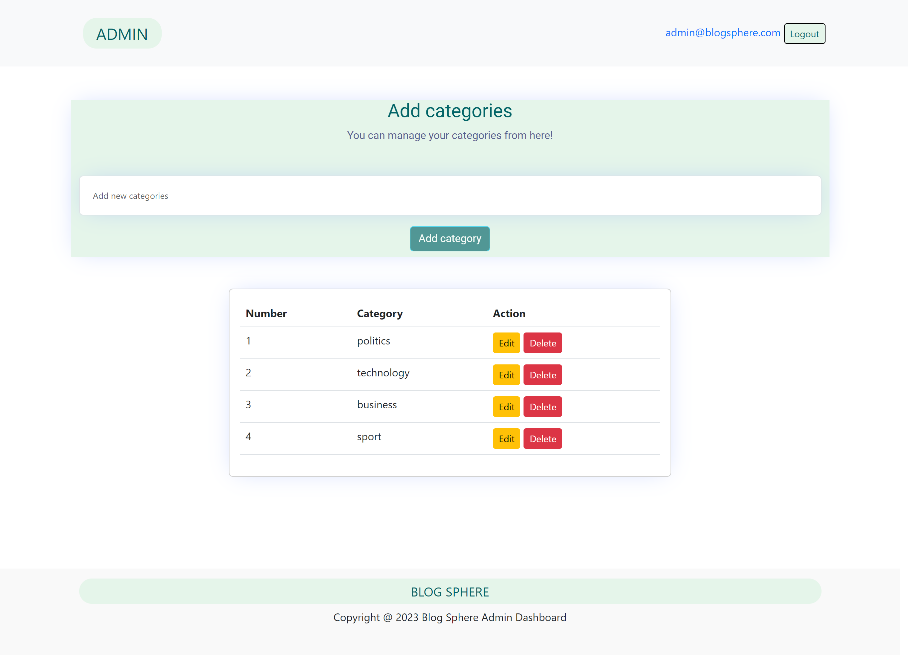

<!-- PROJECT LOGO -->
 

  

  <h3 align="center">Blog Sphere</h3>

  

    Web application for blogging
     
    <a href="https://github.com/mkulovac1/blog-sphere"><strong>Explore the docs »</strong></a>
     
     
    <a href="">View Demo</a>
    ·
    <a href="https://github.com/mkulovac1/blog-sphere/issues">Report Bug</a>
  

<!-- ABOUT THE PROJECT -->
## About The Project

Blog sphere is a web application where users can see and read different posts from different spheres of life such as sports, science, politics, business and etc. On the home page, the user sees the featured posts as well as the most recently added posts. Also, the user can choose the category, which is located on the navigation bar. After clicking, to the user will be shown all the posts related to the given category. When the user clicks on a post, the application takes the user to a page where the details for that post are displayed. When clicking on a post, the number of views of the post increases. Next to that post there are suggestions for similar posts. Under each post there are comments as well as the possibility of writing comments for a given post. Every user can subscribe and that way they will get the latest news from this blog. It is important to note that this project consists of two applications (for the admin and for the user). We have described the application for the user, now it is the admin application's turn. Admin application has authorization and authentication. It is not possible to access the application without prior login. Admin can add, change and delete categories, posts and subscribers.

(<a href="#readme-top">back to top</a>)

## Demo

You can see a demo of this application on the following link: [CLICK ME]()

(<a href="#readme-top">back to top</a>)

## Deployment
You can see this user's side app deployed on the link: [CLICK ME](https://blogsphereapp.netlify.app/)

You can see this admin's side app deployed on the link: [CLICK ME](https://blog-sphere-admin.web.app/)

(<a href="#readme-top">back to top</a>)

## Built With

* Angular 16
* Bootstrap v5
* Cloud Firestore
* Firebase

(<a href="#readme-top">back to top</a>)

<!-- USAGE EXAMPLES -->
## Usage

### User's view

Here you can see examples of using app as user.

**Home page:**

       

**Posts for selected category:**

       

**Selected post:**

       

### Admin's view

Here you can see examples of using app as admin.

**Login page:**

       

**Home page (admin dashboard):** 

       

**Categories page:**

       

**Posts page:**

       

**Add post:**

       

**Edit post:**

       

**Subscribers page:**

_For more examples, please refer to the [Documentation](https://github.com/mkulovac1/blog-sphere/tree/main/documentation)_

(<a href="#readme-top">back to top</a>)

<!-- CONTRIBUTING -->
## Contributing

Contributions are what make the open source community such an amazing place to learn, inspire, and create. Any contributions you make are **greatly appreciated**.

If you have a suggestion that would make this better, please fork the repo and create a pull request. You can also simply open an issue with the tag "enhancement".
Don't forget to give the project a star! Thanks again!

1. Fork the Project
2. Create your Feature Branch (`git checkout -b feature/AmazingFeature`)
3. Commit your Changes (`git commit -m 'Add some AmazingFeature'`)
4. Push to the Branch (`git push origin feature/AmazingFeature`)
5. Open a Pull Request

(<a href="#readme-top">back to top</a>)

<!-- CONTACT -->
## Contact

Merim Kulovac, [@merimkulovac](https://www.linkedin.com/in/merimkulovac/), e-mail: merim.kulovac@outlook.com

(<a href="#readme-top">back to top</a>)

